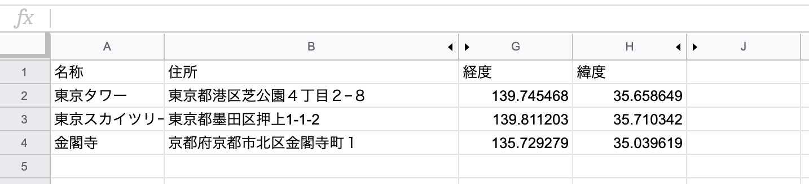
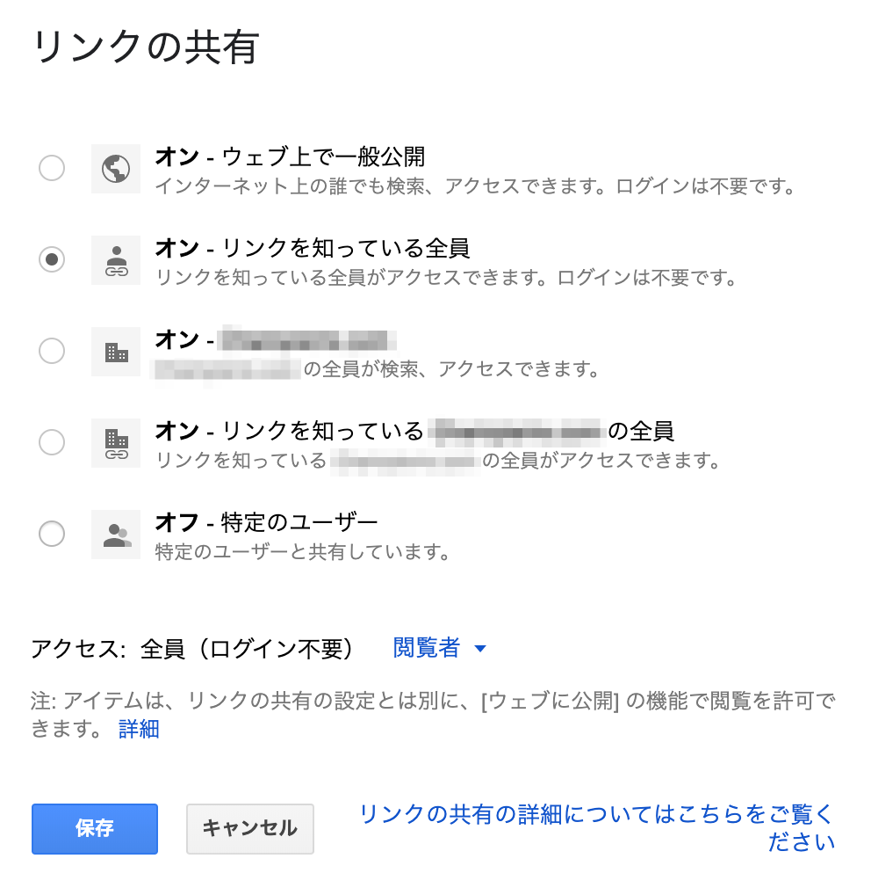
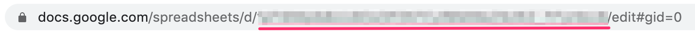
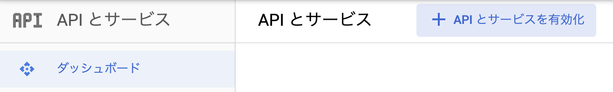
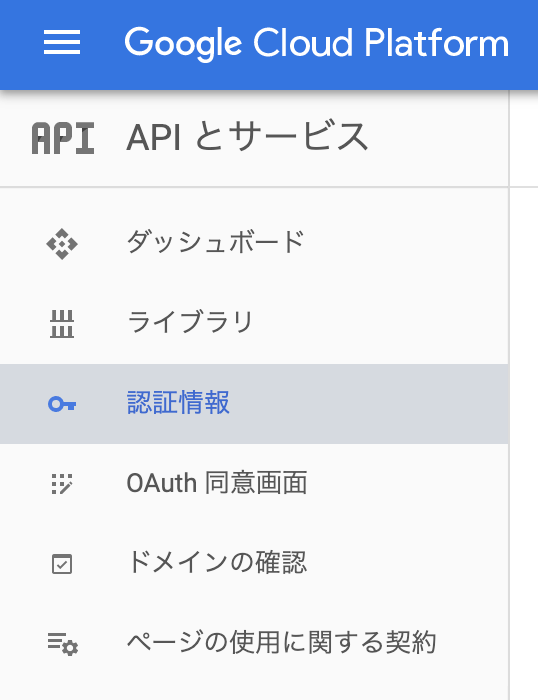
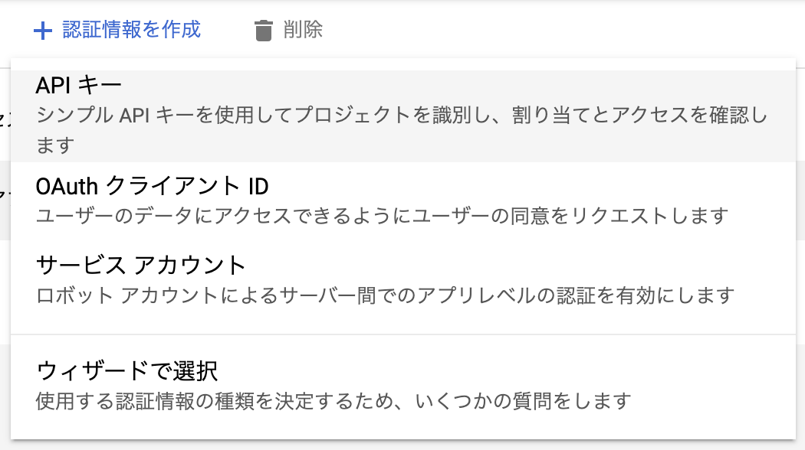
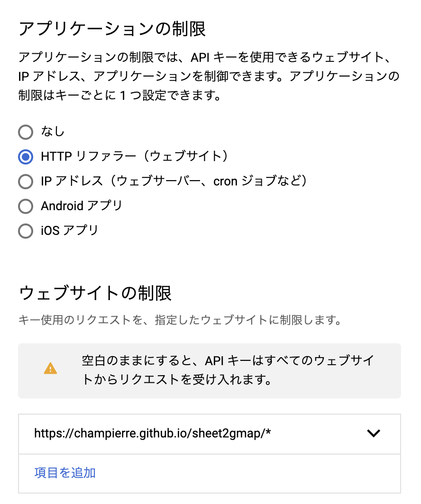
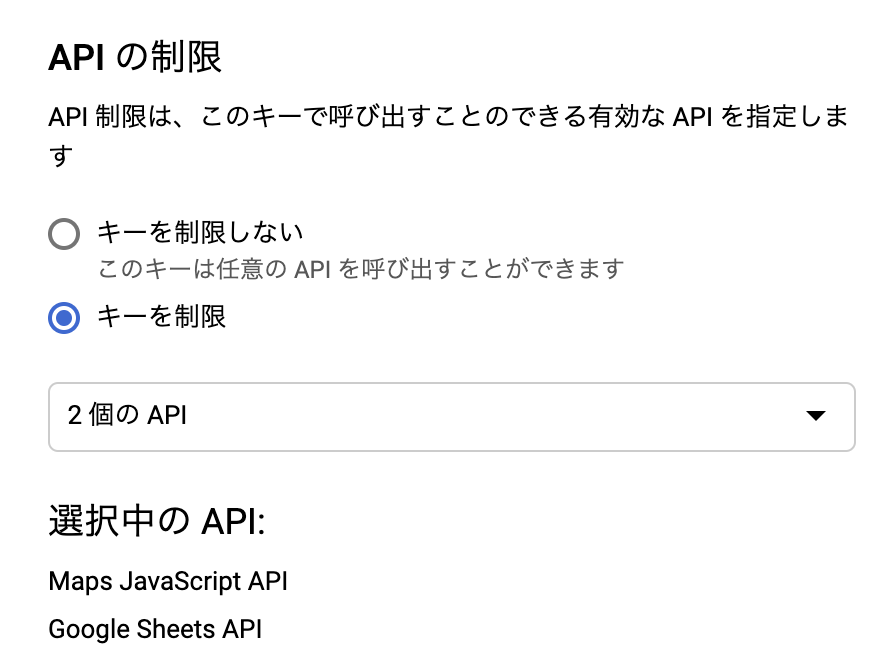

# sheet2gmap

sheet2gmap はたぶん世界一簡単にデータを更新できるマップツールです。


## sheet2gmap の使い方

1. [デモサイト](https://champierre.github.io/sheet2gmap/)を開いて下さい。
2. 「元データ」のリンクをクリックして、Google スプレッドシートを開きます。
3. 名称と住所を入力します。緯度と経度は住所が入力されると、自動的に入力されます。
4. 地図のページをリロードすれば、新しい場所のマーカーが追加されます。

* デモサイトのスプレッドシートは誰でも自由に編集できる権限に設定してあります。実際に名称と住所を入力してみてお試し下さい。故意にデータを削除したり、イタズラするはおやめください。もしそのような行為が続くようであれば、編集権限を削除することになります。

## sheet2gmap の仕組み

- index.html と constants.js の2つのファイルだけで動きます。
- index.html はプログラム本体、constants.js には Google Cloud Platform の API キーと、データ元の Google スプレッドシートの Sheet ID を定義しています。
- 「名称」と「住所」をカラムに持ったデータを Google スプレッドシート上に用意し、そのシートを公開状態にします。
- index.html では、Google Sheets API を読み取り、データをパースして Google Maps 上にピンを追加しています。

## 自分のサイトで動かす方法

- ソースコードをクローンするなり、ダウンロードするなりして自分のサイトにコピーしてください。
- Google スプレッドシートにデータを用意し、「名称」「住所」「緯度」「経度」のカラムを用意します。[Google スプレッド シートで住所→緯度経度変換](https://qiita.com/blue_islands/items/d7e912fe21512cd4c9fd)を参考にして、住所が入力されると、「緯度」と「経度」が自動的に入力されるようにしておくと便利です。



- データが用意できたらシートを公開状態にします。「リンクを知っている全員」が「閲覧者」であれば十分です。



- シートID（下図の下線部分）を constants.js にコピーします。



- 次に Google Cloud Platform の API キーを用意します。持っていなければ、GCP のアカウントを作成します。

- GCP コンソール画面の「API とサービス」>「ダッシュボード」>「APIとサービスを有効化」を選んで、「Maps JavaScript API」と「Google Sheets API」を有効化しておきます。



- GCP コンソール画面の「API とサービス」>「認証情報」の画面を開きます。



-「認証情報を作成」>「API キー」を選びます。



- 作成したAPIキーには、以下のように HTTP リファラーでの制限をかけておくと、別のサイトから利用されず安全です。



- API の制限では、有効化しておいた「Maps JavaScript API」と「Google Sheets API」の2つのAPIだけに制限しておきます。



- 作成した API キーを constants.js にコピーします。

- index.html の

```
<script src="https://maps.googleapis.com/maps/api/js?language=ja&region=JP&key=[API キーを入力してください]&callback=initMap" async defer></script>
```

の[API キーを入力してください]の部分にも API キーをコピーして下さい。

以上の設定をおこなえば、sheet2gmap を自分のサイトで動かすことができます。

## 参考にした情報

Sheetson という Google スプレッドシートの内容を API として簡単に公開できる仕組みを使って、ほぼ要件通りのことを実現している例がありました。大枠はこちらを参考にしたのですが、外部のサービスにはなるべく依存したくなかったので、Sheetson を使う部分は Google Sheets API を直接呼ぶ方法に書き換えました。

- [【Google MAP】スプレッドシートAPI連携による日本世界遺産の表示](https://qiita.com/yoshi_yast/items/9e58e515d67d2251f802)
- [GoogleスプレッドシートだけでAPIが作れる「Sheetson」](https://itnews.org/news_contents/product-sheetson/)

Google スプレッドシートで住所を入力するだけで緯度、経度のデータも取得できる仕組みを作るために以下を参考にしました。

- [Google スプレッド シートで住所→緯度経度変換](https://qiita.com/blue_islands/items/d7e912fe21512cd4c9fd)

Google Sheet API を呼ぶところは結構詰まったのですが、以下を参考にして解決できました。

- [Google Sheet APIを試す時に詰まったところ](https://qiita.com/yukyt/items/c27c344211423f2bb44d)
