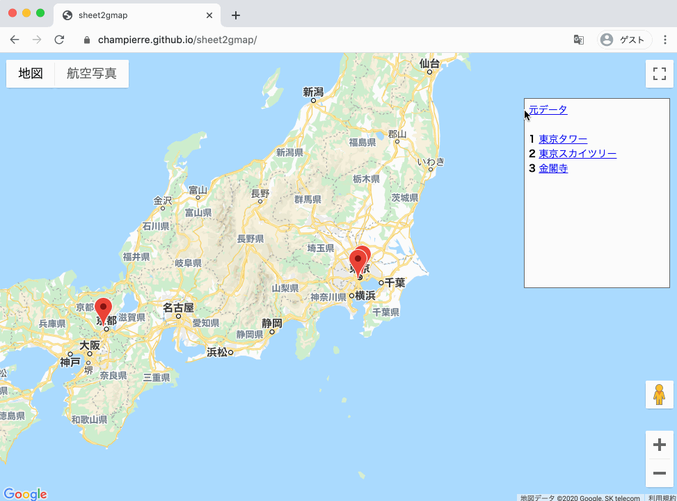

# sheet2gmap

sheet2gmap はたぶん世界一簡単にデータを更新できるマップツールです。

1. [デモサイト](https://champierre.github.io/sheet2gmap/)を開いて下さい。
2. 「元データ」のリンクをクリックして、Google スプレッドシートを開きます。
3. 名称と住所を入力します。緯度と経度は住所が入力されると、自動的に入力されます。
4. 地図のページをリロードすれば、新しい場所のマーカーが追加されます。
